

  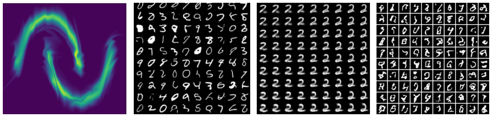

# 🎨 Deep Generative Models: Homework Solutions

My solutions for **Deep Generative Models** (EE Department, Sharif University of Technology, Fall 2025, Dr. Sajjad Amini).

The course is about the different ways of answering one question: *how do you write down a probability distribution over something as complicated as an image or a sound, and then sample from it?* Each homework takes one family of answers, works through the math on paper, and then builds a model in PyTorch:

| # | Homework | Model family | What I built |
|:-:|---|---|---|
| 1 | 🎵 [Autoregressive Models](#hw1) | Predict one element at a time | WaveNet for raw audio, PixelCNN on CIFAR-10 |
| 2 | 🧩 [Variational Autoencoders](#hw2) | Latent variables + ELBO | A temporal graph VAE, a conditional VAE on MNIST |
| 3 | 🌊 [Normalizing Flows](#hw3) | Invertible maps with exact likelihood | RealNVP from scratch, Glow for image inpainting |
| 4 | ⚔️ [GANs](#hw4) | Adversarial training | Theory problems |
| 5 | 🔥 [Energy & Score-Based Models](#hw5) | Learn an energy or its gradient | A JEM-style EBM, denoising score matching, NCSN |

Each folder has the problem set (`Problem set N.pdf`), my written solutions (typeset in LaTeX), and the practical notebooks. All pictures below come from my notebooks' outputs.

---

## 🎵 1. Autoregressive Models

📂 [`HW1/`](HW1/)

The simplest honest way to model a joint distribution is the chain rule: p(x) = ∏ p(xi | x&lt;i). There are no approximations, and you get an exact likelihood. The cost is that generation is one element at a time.

### Theory

- **Gaussian toolkit.** Linear transformations and sums of Gaussians, marginals and conditionals of joint Gaussians, and the closed-form KL divergence between two multivariate Gaussians. These results come back in every later homework.
- **AR(p) models.** The likelihood and maximum-likelihood estimates for a linear autoregressive process, a proof that AR(1) is a Markov chain, and its stationary distribution.
- **Nonlinear AR models.** Architecture choices for short vs. long context, multi-step prediction, conditioning, and the KL divergence between two conditional models.

### 🎧 WaveNet: generating raw audio

[`hw-01-generative_Q1.ipynb`](HW1/Practical/hw01_DGM_401102191/hw-01-generative_Q1.ipynb)

WaveNet predicts the next audio sample from all the previous ones. Two ideas make that work:

1. **μ-law quantization.** The 16-bit audio is squashed with a logarithmic curve and quantized to 256 levels. Predicting the next sample then becomes a 256-way *classification* problem, trained with cross-entropy.
2. **Dilated causal convolutions.** Each layer doubles its dilation (1, 2, 4, … 512), so the receptive field grows exponentially with depth while the model can still never "see the future". Gated activations, residual connections and skip connections tie the stack together.

My model has two blocks of 10 dilated layers (about 101k parameters). I trained it for 30 epochs on the course's audio dataset.

  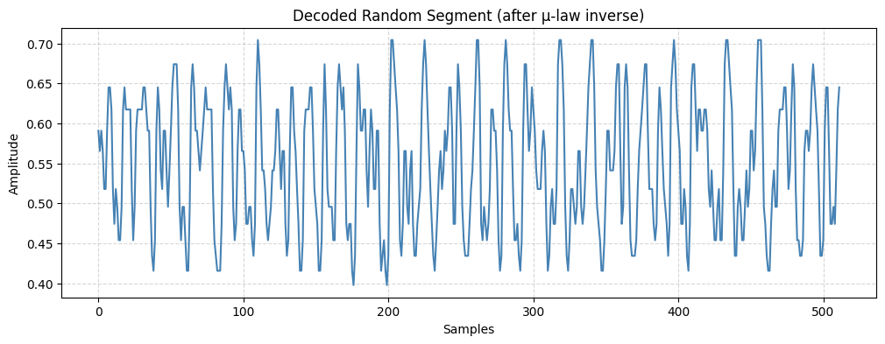
  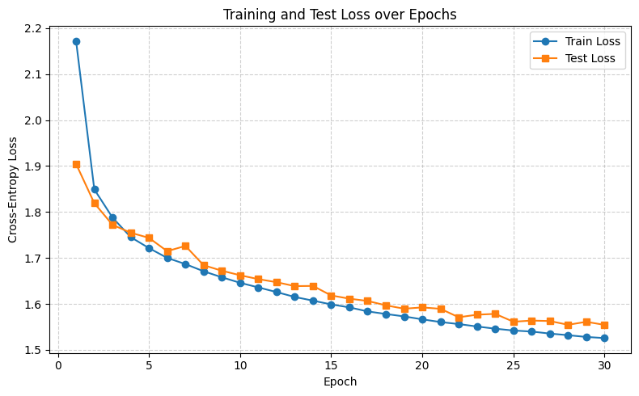
   
  <em>Left: a training segment after μ-law decoding. Right: train and test cross-entropy both drop steadily, from about 2.2 to 1.55 nats.</em>

To generate, I start from silence and sample 16 000 steps, each conditioned on everything generated so far. That is one second of audio at 16 kHz.

  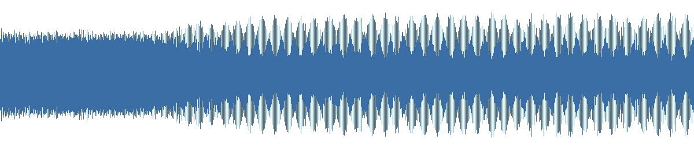
   
  <em>The generated second of audio: it starts out noisy and then settles into a regular, periodic pattern. 🔊 <a href="assets/hw1/wavenet_sample.wav">Listen to it</a>.</em>

### 🖼️ PixelCNN on CIFAR-10 (optional)

[`hw-01-genrative_Q2.ipynb`](HW1/Practical/hw01_DGM_401102191/hw-01-genrative_Q2.ipynb)

The same idea applied to images: pixels are generated in raster order, and **masked convolutions** make sure each pixel only depends on the ones above it and to its left. The notebook implements both the masked-convolution PixelCNN and PixelRNN's diagonal LSTM. I trained the PixelCNN for 100k steps on CIFAR-10.

---

## 🧩 2. Variational Autoencoders

📂 [`HW2/`](HW2/)

VAEs explain the data through a hidden variable z. The exact likelihood p(x) = ∫ p(x|z)p(z)dz is intractable, so we maximize a lower bound instead, the **ELBO**: a reconstruction term minus a KL term that keeps the encoder's q(z|x) close to the prior.

### Theory

- **Conditional VAE.** Derives the conditional ELBO for p(x|y), shows which q gives the tightest bound, and explains how to evaluate and sample the model for a new label (e.g. generating an image from a text description).
- **Cauchy–Schwarz divergence.** A closed form for Gaussians and a proof that it is bounded by both directions of the KL. It is a useful replacement for the KL when the prior or posterior is a Gaussian mixture, where the KL has no closed form.
- **Posterior collapse.** Why a powerful decoder can learn to ignore z entirely, and how to spot it and prevent it.
- **Probabilistic graph forecasting.** The ELBO for a sequence of graphs with an autoregressive decoder.

### 🕸️ A VAE for evolving graphs

The first practical question turns that last theory problem into code. I generated synthetic **dynamic graphs**: 3 communities from a stochastic block model (edge probability 0.6 inside a community, 0.05 between), with Gaussian node features and slow drift over time.

The **Temporal Graph VAE** encodes each snapshot into a latent zt, learns a Gaussian transition p(zt+1|zt), and decodes node features (Gaussian) and edges (Bernoulli). The KL weight is warmed up from 0 to 0.1 so the model first learns to reconstruct at all.

  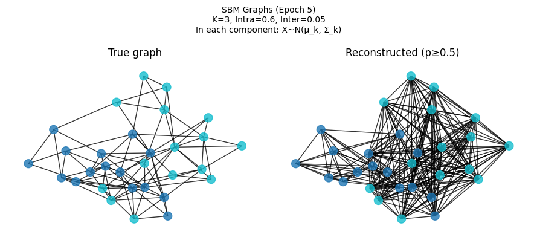
  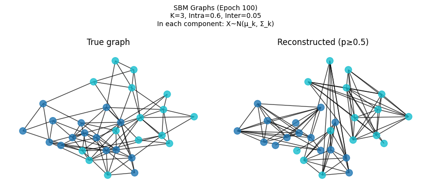
   
  <em>True graph vs. reconstruction at epoch 5 (left) and epoch 100 (right).</em>

At epoch 5, the model draws edges almost everywhere. By epoch 100, it has learned that the graph is sparse and roughly where the dense communities are. The reconstructions are still far from perfect: on held-out sequences, **73.9 %** of edges are predicted correctly.

### ✍️ Conditional VAE on MNIST

The second question is a CVAE that generates a digit *on demand*. Both the encoder q(z|x, y) and the decoder p(x|z, y) receive the label y. The label then decides *which* digit to draw, and z is free to capture *how* it's written. After 150 epochs, the loss settled at about 100 nats per image (81 of reconstruction, 19 of KL).

  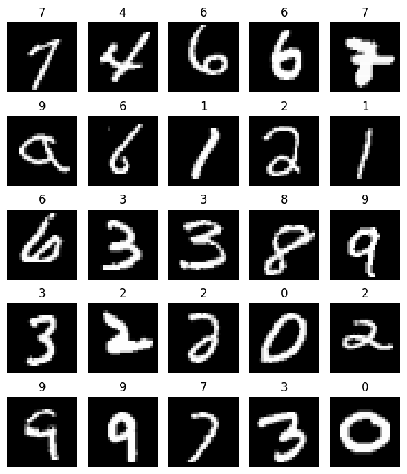
  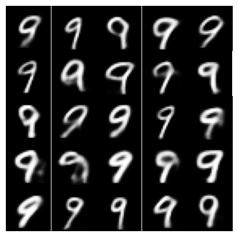
   
  <em>Real MNIST digits (left) and CVAE samples with the label fixed to 9 (right).</em>

**Walking through the latent space.** Fixing the label and moving z along two random directions shows what the model learned about handwriting. For the 2s, moving left to right turns a wide, flat, Z-like 2 into a narrower, slanted 2 with a loop at the bottom. Moving down makes the strokes bolder and rounder. The changes are smooth, and every cell is still clearly a 2. That is exactly what separating content (y) from style (z) should look like.

  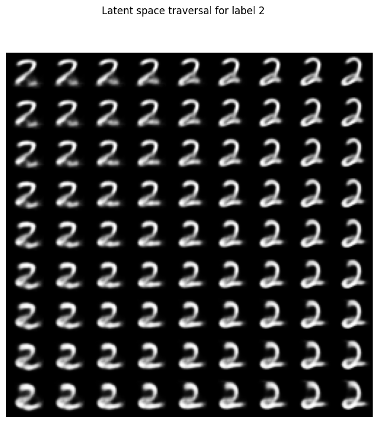
  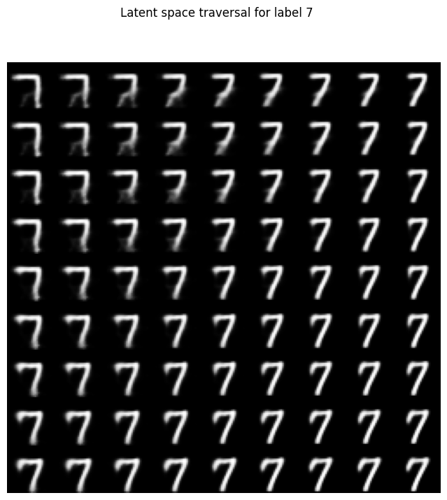
  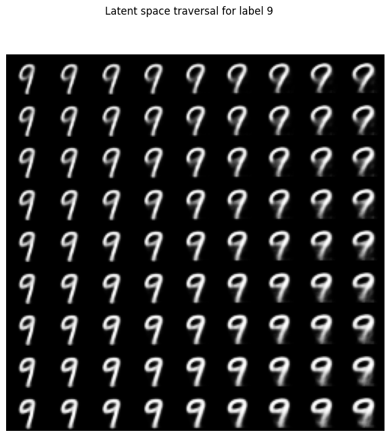
   
  <em>9×9 latent traversals for the digits 2, 7 and 9. The center of each grid is z = 0.</em>

**Bonus: my student ID in changing handwriting.** I found a "thickness" direction in latent space by correlating random z's with the total ink of the digits they decode to. Then I wrote out my student ID while sliding along that direction, so the handwriting changes from one digit to the next.

  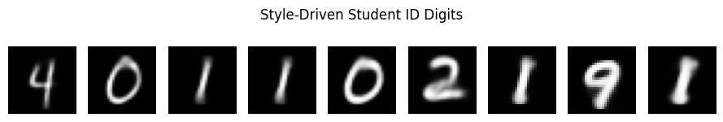

---

## 🌊 3. Normalizing Flows

📂 [`HW3/`](HW3/)

A flow pushes a simple Gaussian through a chain of **invertible** functions. Because every step can be undone, the change-of-variables formula gives the *exact* log-likelihood:

log p(x) = log p(z) + Σ log |det ∂fk⁻¹/∂x|.

The whole design problem is building layers that are expressive but still have a cheap Jacobian determinant.

### Theory

- **Glow's 1×1 convolution.** Invertibility conditions, and the LU parameterization that makes log |det W| a simple sum of log |si|. Also how to invert it with forward and back substitution.
- **Continuous normalizing flows.** Derives d log p(z(t))/dt = −Tr(∂f/∂z) step by step, including a proof of Jacobi's formula.
- **Duality in autoregressive flows** (MAF vs. IAF), and **VAEs with conditional flows** as richer posteriors.

### 🌙 A flow from scratch

I wrote every layer myself: permutations, **ActNorm** (per-feature scale and shift with data-dependent initialization), an **invertible linear** layer with an optional LU parameterization, and **RealNVP affine coupling**, where half the features are scaled and shifted by functions of the other half. Stacking 6 coupling layers and fitting them to the two-moons dataset, you can watch the Gaussian get bent into two crescents:

  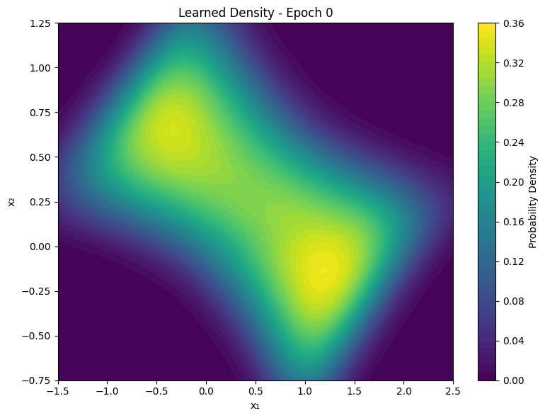
  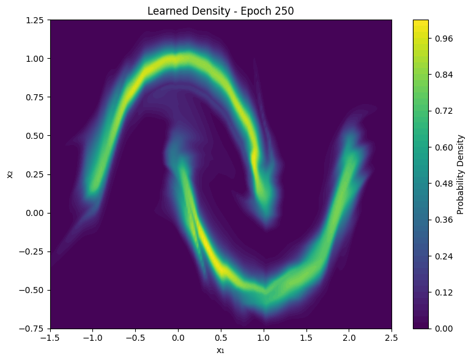
  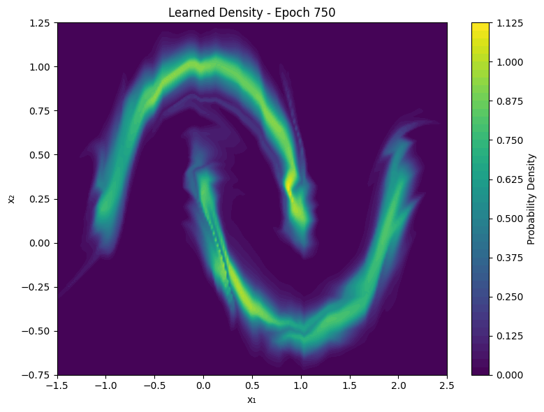
   
  <em>Learned density at epochs 0, 250 and 750.</em>

I compared two variants. One mixes features with learned invertible linear layers (RealNVP); the other uses fixed permutations (PermutFlow). They end up very close: the final NLL is 0.755 for RealNVP vs. 0.774 for PermutFlow. For two dimensions, the learned mixing helps a little but isn't essential.

  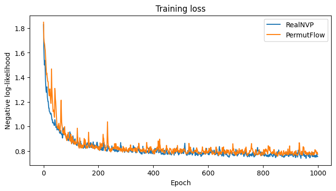
  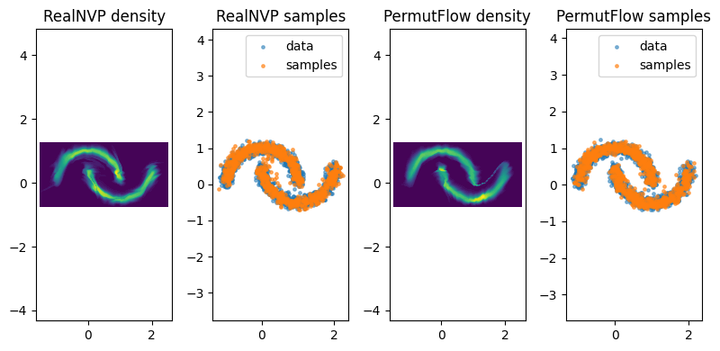
   
  <em>Training curves (left); density and samples for both flows (right).</em>

### 🩹 Glow and image inpainting

For images, I used a class-conditional **Glow** (2 levels × 16 blocks, from `normflows`) trained on MNIST for 15k iterations.

  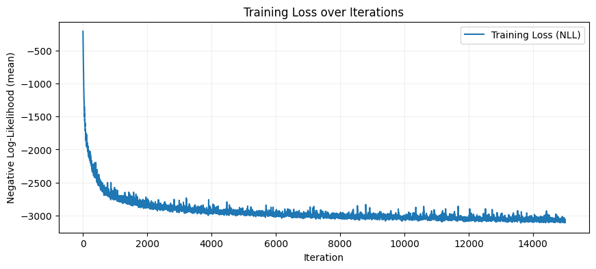
  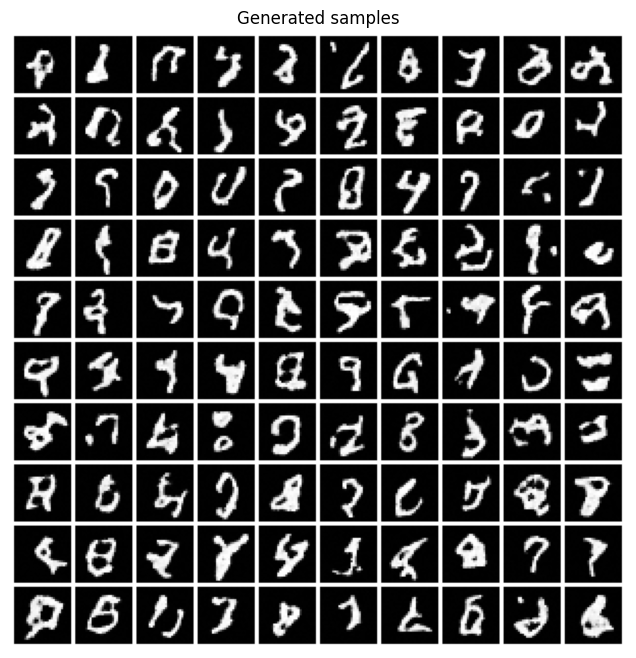
   
  <em>Training NLL (left) and samples (right). They look digit-like but rough; the notebook itself notes that competitive samples need a much bigger model.</em>

The fun part is **inpainting**. Because a flow gives an exact log p(x), you can hide part of an image, treat the hidden pixels as parameters, and run gradient ascent on log p(x) with the visible pixels held fixed. The model fills the hole with whatever it finds most likely.

  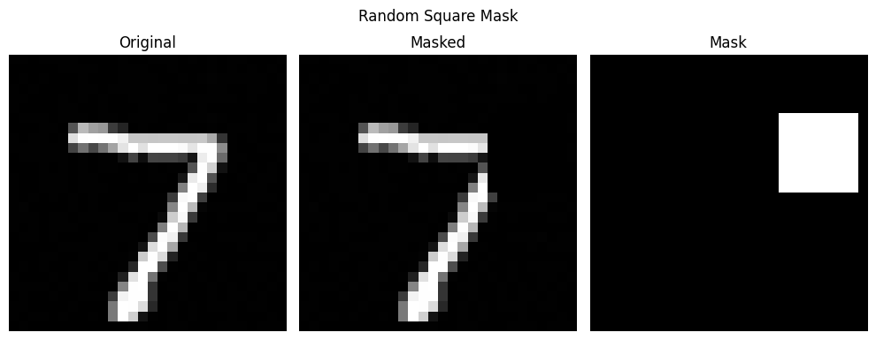
  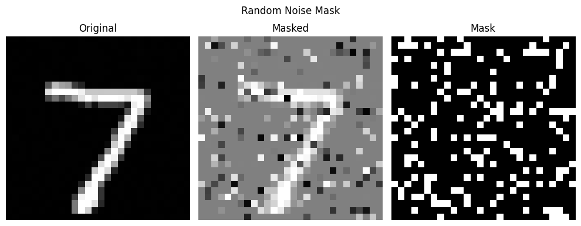
   
  <em>The two kinds of corruption I tried: a missing square and random missing pixels.</em>

  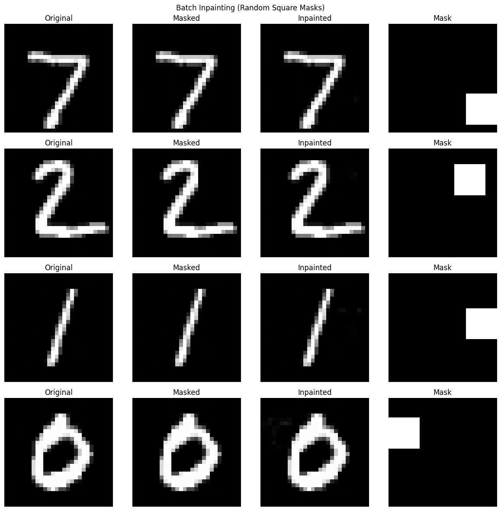
   
  <em>Original, masked, inpainted and mask for four test digits. Missing strokes are filled in plausibly.</em>

---

## ⚔️ 4. Generative Adversarial Networks

📂 [`HW4/`](HW4/) · problem set only for now

A GAN never writes down p(x). Instead, a generator learns to fool a discriminator. The problem set works out what that game is actually optimizing:

- **Divergence minimization.** The optimal discriminator is D* = pdata / (pdata + pθ), so its logits estimate the log density ratio. A particular generator loss then reduces to KL(pθ ‖ pdata), which makes a nice contrast with the VAE's KL in the other direction.
- **Discriminating real from fake.** How the best achievable classification loss relates to a distance between the real and generated distributions.
- **Mode collapse and Wasserstein GAN**, and **AC-GAN**, which adds an auxiliary classifier for conditional generation.

---

## 🔥 5. Energy-Based and Score-Based Models

📂 [`HW5/`](HW5/)

The last homework drops the requirement that the model be normalized. An **energy-based model** only says which images are *more likely* than others, via p(x) ∝ e−E(x). A **score-based model** goes one step further and learns only the gradient ∇x log p(x). In both cases, you sample by following the gradient uphill with some noise: **Langevin dynamics**.

### Theory

- **MCMC foundations.** Why irreducibility, aperiodicity and positive recurrence are exactly what a sampler needs, and how detailed balance makes Metropolis–Hastings target the right distribution.
- **Score matching variants.** Explicit vs. implicit score matching, and noisy explicit score matching vs. denoising score matching (DSM).
- Score-based models and EBMs more broadly.

### ⚡ An energy-based model on MNIST

[`DGM_HW5_Q1_401102191.ipynb`](HW5/DGM_HW5_Q1_401102191.ipynb)

Following the JEM idea, I reused a classifier as an energy model: the energy of an image is −LogSumExp of the classifier's logits. The network is a small CNN with spectral normalization, trained on 16×16 MNIST. The loss combines ordinary cross-entropy with a generative term that pushes the energy *down* on real images and *up* on samples from 100 steps of Langevin dynamics.

  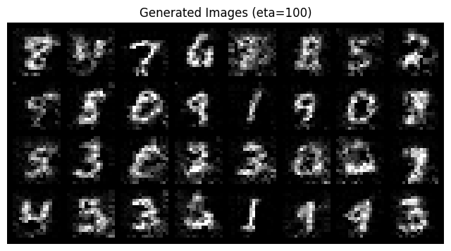
  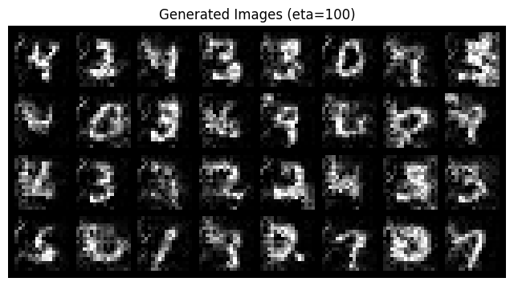
   
  <em>Langevin samples after 5 and 10 epochs. Digit shapes start to appear.</em>

After epoch 10, training went wrong in an instructive way. The loss plunged to large negative values, meaning the model had pushed real and sampled energies too far apart. The energy landscape became so steep that Langevin sampling broke down, and the samples dissolved into noise:

  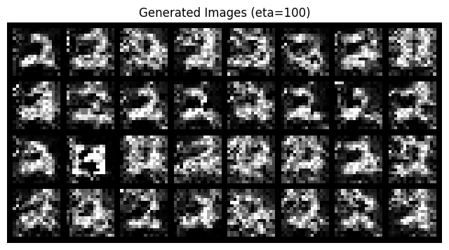
  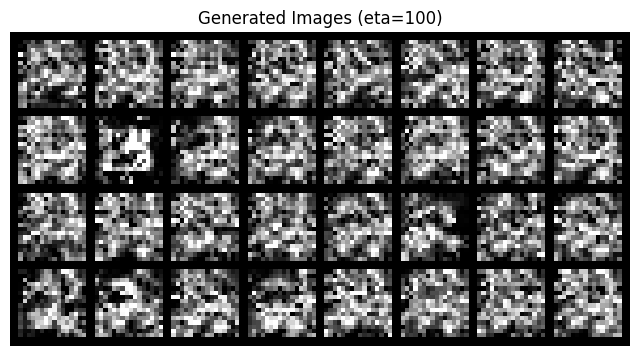
  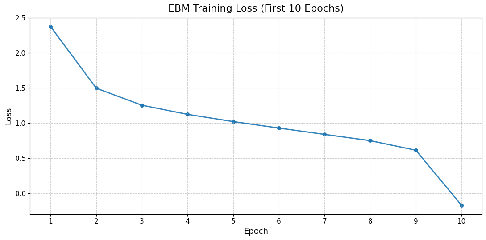
   
  <em>Samples at epochs 15 and 20, and the loss over the first 10 epochs (right), which already starts to dive at the end.</em>

EBMs are notoriously unstable to train, and this run shows why: the best checkpoints here are the early ones.

### 🎯 Denoising score matching and NCSN

[`DGM_HW5_Q2_401102191.ipynb`](HW5/DGM_HW5_Q2_401102191.ipynb)

Learning ∇ log p(x) directly seems impossible because the true score is unknown. **Denoising score matching** gets around this: add Gaussian noise to the data and train the network to point back toward the clean point. That target is known in closed form. The notebook also derives implicit score matching and the reverse conditional q(xt−1|xt, x0) for the NCSN noise chain.

On **two moons**, a small score network trained with DSM and then sampled with 10 000 Langevin steps recovers both crescents:

  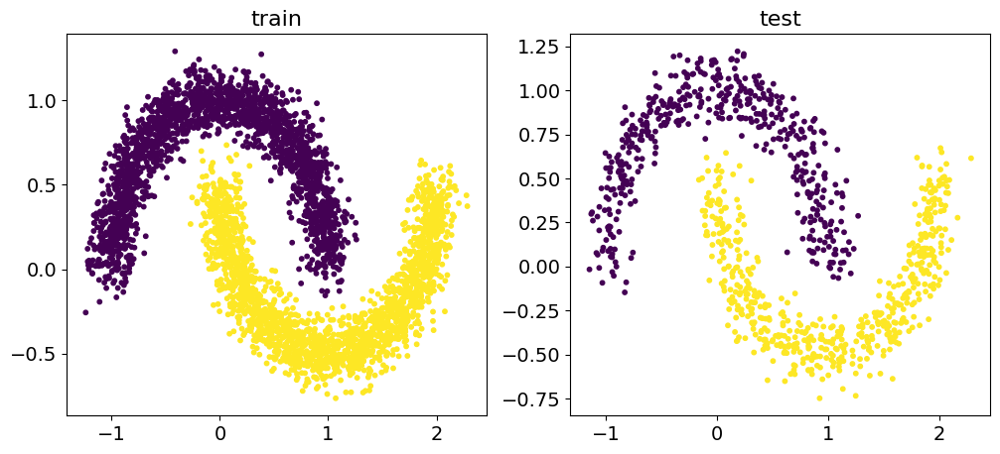
  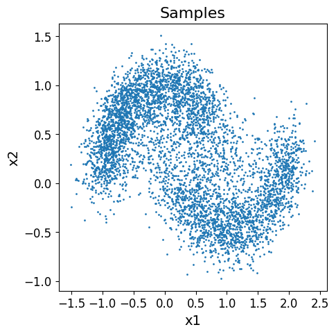
   
  <em>Training and test data (left) and 5 000 Langevin samples from the learned score (right).</em>

A single noise level struggles in high dimensions: far from the data, the score is never learned. A **Noise Conditional Score Network (NCSN)** trains one U-Net on a geometric ladder of noise levels. At sampling time it anneals from the largest noise level down to the smallest. After 15 epochs on MNIST:

  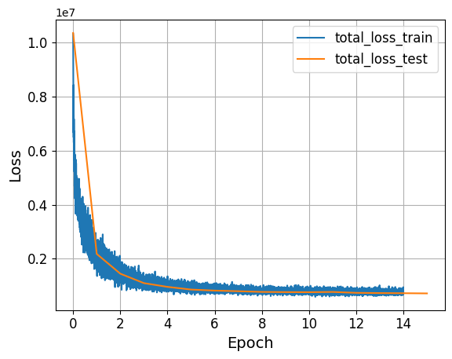
  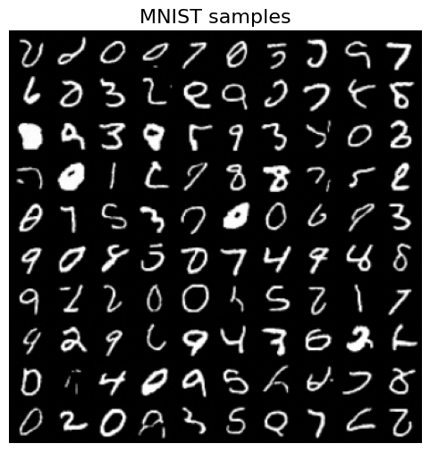
   
  <em>NCSN training loss (left) and samples from annealed Langevin dynamics (right). Most are clearly readable digits.</em>

These are the best samples in the whole repo. Score-based models are the direct ancestors of today's diffusion models.

---

  Problem sets and starter notebooks by the course staff · Solutions and figures by Amir Kooshan Fattah Hesari

